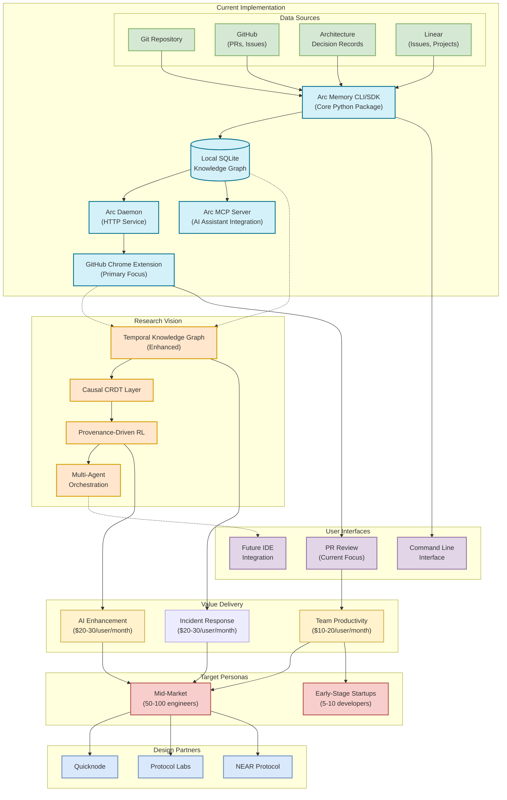
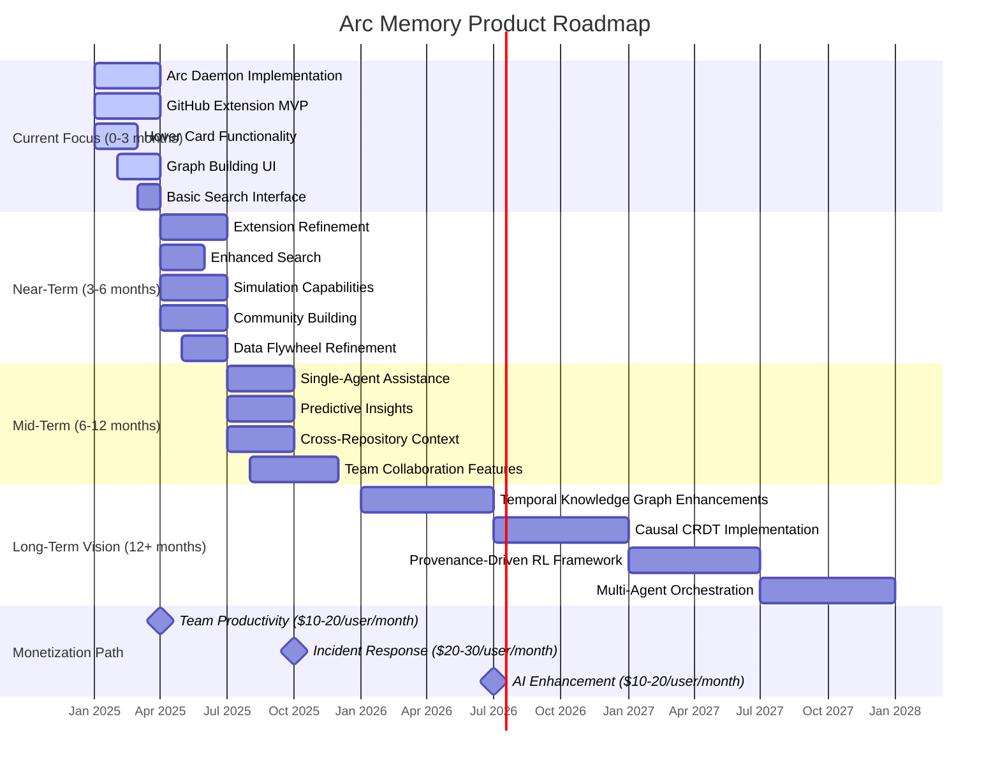
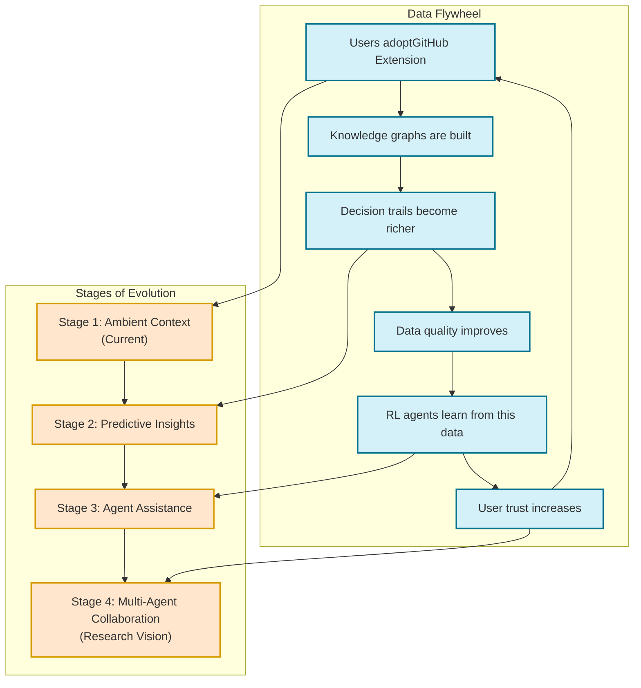

# Arc Memory Architecture & Roadmap Diagrams

## System Architecture Diagram

This diagram shows how all components of Arc Memory connect together, from current implementation to research vision.

## Product Roadmap Timeline

This diagram shows the evolution of Arc Memory from current focus to long-term vision.

## Data Flywheel Diagram

This diagram illustrates how Arc Memory creates a reinforcing data flywheel.

