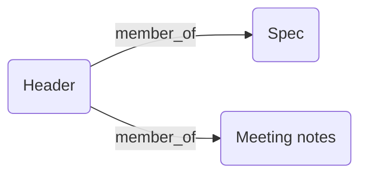

# Recipe – Collections & Relationships

Group several documents under a logical *collection* and keep the structure queryable via relationships.

---

## 1. Create a **collection header**

```python
from contextframe import FrameRecord, FrameDataset

header = FrameRecord.create(
    title="🗂️ Project Alpha",
    content="This is the header describing Project Alpha.",
    collection="project-alpha",
    record_type="collection_header",
)

DATASET = "projects.lance"
FrameDataset.create(DATASET, overwrite=True)
header.save(DATASET)
print("Header UUID:", header.uuid)
```

## 2. Add member documents

```python
members = [
    FrameRecord.create(title="Spec", content="…", collection="project-alpha"),
    FrameRecord.create(title="Meeting notes", content="…", collection="project-alpha"),
]
for m in members:
    # Link back to header (type = `member_of`)
    m.add_relationship(header, relationship_type="member_of")
    m.save(DATASET)
```

## 3. Query the collection

```python
from contextframe import FrameDataset

ds = FrameDataset.open(DATASET)

header_doc = ds.get_collection_header("project-alpha")
print("Header title:", header_doc.title)

member_docs = ds.get_members_linked_to_header(header_doc.uuid)
print("Members:", [d.title for d in member_docs])
```

---

Diagram of the relationship:


