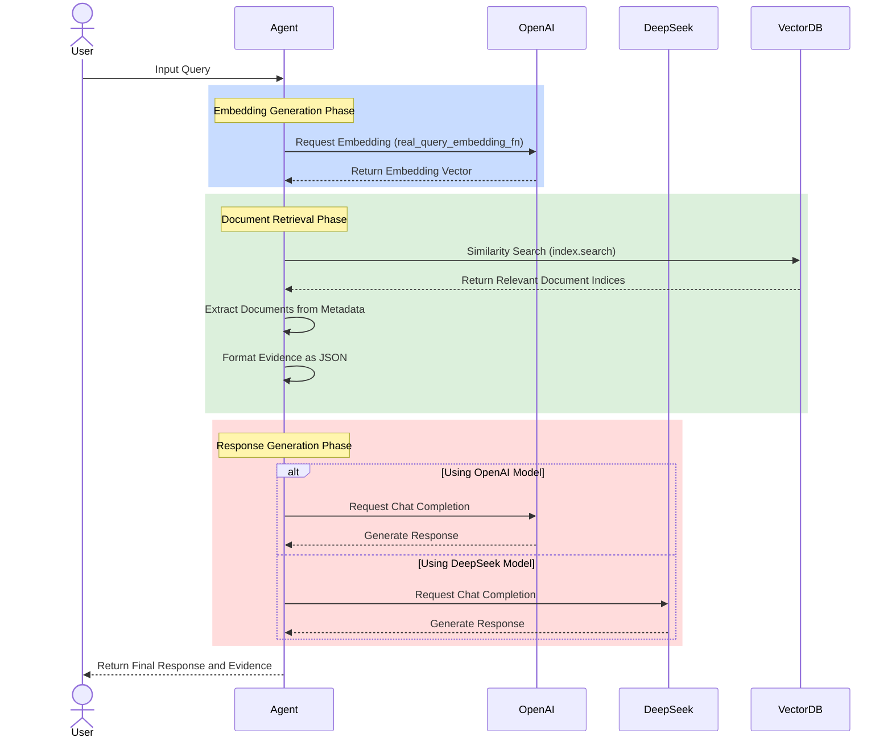

# easy_rag_llm

## CAUTION
- easy-rag-llm==1.0.* version is testing version. These versions are usually invalid.

## 🇰🇷 소개
- easy_rag_llm는 OpenAI 및 DeepSeek 모델을 지원하는 간단한 RAG(정보 검색 및 생성) 기반 서비스를 제공합니다. 간단하게 RAG LLM을 서비스에 통합시킬 수 있도록 만들어졌습니다.
- (2025.01.16 기준/ v1.1.0) 학습가능한 자료 포맷은 PDF입니다.

## 🇺🇸 Introduction
- easy_rag_llm is a lightweight RAG-based service that supports both OpenAI and DeepSeek models.
It is designed to seamlessly integrate RAG-based LLM functionalities into your service.
- As of 2025-01-15 (v1.1.0), the supported resource format for training is PDF.

## Usage
#### Install (https://pypi.org/project/easy-rag-llm/)
```bash
pip install easy_rag_llm
```

#### How to integrate to your service?
```python
from easy_rag import RagService

# Basic initialization
rs = RagService(
    embedding_model="text-embedding-3-small", #Fixed to OpenAI model
    response_model="deepseek-chat",  # Options: "openai" or "deepseek-chat"
    open_api_key="your_openai_api_key_here",
    deepseek_api_key="your_deepseek_api_key_here",
    deepseek_base_url="https://api.deepseek.com",
    context_expansion=False,  # Enable/disable context expansion
    expansion_window=1  # Number of chunks to include before and after
)

# Example with OpenAI chat model
rs2 = RagService(
    embedding_model="text-embedding-3-small",
    response_model="gpt-3.5-turbo",
    open_api_key="your_openai_api_key_here",
)

# Resource Loading Parameters
resource = rs.rsc(
    "./rscFiles",
    force_update=False,  # Force rebuild index
    chunkers=10,  # Number of parallel chunking workers
    embedders=10,  # Number of parallel embedding workers
    ef_construction=200,  # HNSW index construction parameter
    ef_search=100,  # HNSW search parameter
    M=48  # HNSW graph parameter
)

# Generate Response with Context Expansion
query = "Explain what is taught in the third week's lecture."
response, top_evidence = rs.generate_response(
    resource,
    query,
    evidence_num=5,  # Number of evidence chunks to retrieve (default: 3)
    context_expansion=True,  # Enable context expansion for this query
    expansion_window=2  # Include 2 chunks before and after
)

print(response)

# Change Context Expansion Settings
rs.set_context_expansion(enable=True, window_size=2)
```

### 🇰🇷 안내
- pdf 제목을 명확하게 적어주세요. 메타데이터에는 pdf제목이 추출되어 들어가며, 답변 근거를 출력할때 유용하게 사용될 수 있습니다.
- `rs.rsc("./folder")` 작동시 `faiss_index.bin`과 `metadata.json`이 생성됩니다. 이후엔 이미 만들어진 .bin과 .json으로 답변을 생성합니다. 만약 폴더에 새로운 파일을 추가하거나 제거하여 변경하고 싶다면 `force_update=True`로 설정하여 강제업데이트가 가능합니다.
- chunkers는 pdf 분할 병렬처리를 위한 동시작업 개수이고, embedders는 임베딩 작업 병렬처리를 위한 동시작업 개수입니다. 둘다 기본값 10으로 각각 CPU 코어개수와 api ratelimit에 영향을 받으므로 적절히 조절해야합니다.
- context_expansion 기능을 사용하면 검색된 문맥의 앞뒤 청크를 포함하여 더 넓은 맥락을 제공할 수 있습니다. expansion_window로 앞뒤로 몇 개의 청크를 포함할지 설정할 수 있습니다.

### 🇺🇸 Note
- Ensure that your PDFs have clear titles. Extracted titles from the PDF metadata are used during training and for generating evidence-based responses.
- Running `rs.rsc("./folder")` generates `faiss_index.bin` and `metadata.json` files. Subsequently, the system uses the existing .bin and .json files to generate responses. If you want to reflect changes by adding or removing files in the folder, you can enable forced updates by setting `force_update=True`.
- The `chunkers` parameter controls parallel processing for PDF chunking, while `embedders` controls parallel processing for embedding generation. Both default to 10 and should be adjusted based on CPU cores and API rate limits.
- The context expansion feature allows including surrounding chunks for better context understanding. Use `expansion_window` to control how many chunks to include before and after.

### Advanced Parameters

#### Resource Loading (rs.rsc)
- `force_update`: Force rebuild of index (default: False)
- `chunkers`: Number of parallel PDF chunking workers (default: 10)
- `embedders`: Number of parallel embedding workers (default: 10)
- `ef_construction`: HNSW index construction parameter (default: 200)
- `ef_search`: HNSW search parameter (default: 100)
- `M`: HNSW graph parameter (default: 48)

#### Response Generation (generate_response)
- `evidence_num`: Number of evidence chunks to retrieve (default: 3)
- `context_expansion`: Enable/disable context expansion for the query
- `expansion_window`: Number of chunks to include before and after

### release version.
- 1.0.12 : Supported. However, the embedding model and chat model are fixed to OpenAI's text-embedding-3-small and deepseek-chat, respectively. Fixed at threadpool worker=10, which may cause errors in certain environments.
- v1.1.5 : recommend.

### UML


### Execution flow



### TODO
- 청크를 나누는 방식에 대한 개선. 
- 입력포맷 다양화. pdf외 지원. (v1.2.0 ~)


### What can you do with this?
https://github.com/Aiden-Kwak/ClimateJudgeLLM


### Release Message
v1.1.5<br/>
: Vector Searching method is changed to HNSW. <br/>
: The speed of vector embedding has been significantly improved, reducing the time by 90%, making it 10 times faster than before! (10sec for 500 page PDF.)
<br/>
v1.1.6<br/>
: Added context expansion feature for better document understanding
: Added version requirements for dependencies
: Improved package metadata and documentation


### Author Information
- 곽병혁 (https://github.com/Aiden-Kwak)
