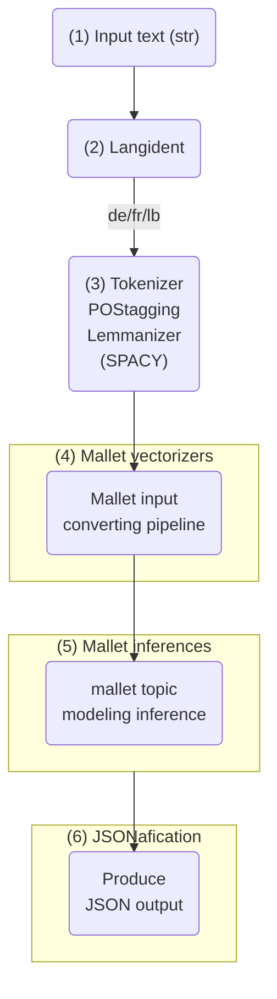

# Python Package: [impresso-pipelines]

## Overview
This repository contains a Python package designed for efficient and modular processing. Currently, it includes the following subpackages:

- **Language Identification Pipeline**: Pipeline that automatically detects the language of input text and provides its corresponding probability score.
- **OCR QA Pipeline**: Pipeline that evaluates the quality of OCR-processed text by calculating a score (0-1) representing the proportion of recognized words in the input text against a language-specific Bloom filter database.
- **Mallet Pipeline**:


## Installation
To install the package, use:
```bash
pip install impresso_pipelines[all]
```
If you want to install only the language identification pipeline, use:
```bash
pip install impresso_pipelines[langident]
```
If you want to install only the OCR QA pipeline, use:
```bash
pip install impresso_pipelines[ocrqa]
```

## Usage
Import and use the subpackages as follows:
```python
from impresso_pipelines.langident import LangIdentPipeline
from impresso_pipelines.ocrqa import OCRQAPipeline
```

## Running the Pipelines (Basic)

### Language Identification Example
```python
# Initialize the pipeline
lang_pipeline = LangIdentPipeline()

# Example text in German
de_text = "Ein kleiner Hund namens Max lebte in einem ruhigen Dorf. Jeden Tag rannte er durch die Straßen und spielte mit den Kindern. Eines Tages fand er einen geheimen Garten, den niemand kannte. Max entschied sich, den Garten zu erkunden und entdeckte viele schöne Blumen und Tiere. Von diesem Tag an besuchte er den Garten jeden Nachmittag."
     

# Detect language
result = lang_pipeline(de_text)
print(result)
```
**Expected Output:**
```
{'language': 'de', 'score': 1.0}
```
Score represents the probability of the detected language based on the input text.

### OCR QA Example
```python
# Initialize the pipeline
ocrqa_pipeline = OCRQAPipeline()

# Example text extracted from OCR
de_text = "Ein kleiner Hund namens Max lebte in einem ruhigen Dorf. Jeden Tag rannte er durch die Straßen und spielte mit den Kindern. Eines Tages fand er einen geheimen Garten, den niemand kannte. Max entschied sich, den Garten zu erkunden und entdeckte viele schöne Blumen und Tiere. Von diesem Tag an besuchte er den Garten jeden Nachmittag."
     

# Get an answer
result = ocrqa_pipeline(de_text)
print(result)
```
**Expected Output:**
```
{'language': 'de', 'score': 1.0}
```
Score roughly represents the ratio between known and unknown words in the text in comparison to the language-specific Bloom filter database.


## Mallet Pipeline

### Diagram

### 1. Input Text (str)
The pipeline starts with a text input in string format. This could be any textual data that needs to be analyzed.

### 2. Langident (Language Identification)
The system uses a language identification tool to detect the language of the input text. Based on the output, the text is classified as German (`de`), French (`fr`), or Luxembourgish (`lb`).

### 3. Tokenizer, POS Tagging, and Lemmatization (Using SpaCy)
Once the language is identified, the text undergoes several preprocessing steps:
- **Tokenization**: The text is split into individual words.
- **Part-of-Speech (POS) Tagging**: Words are assigned grammatical categories (e.g., noun, verb, adjective).
- **Lemmatization**: Words are reduced to their base form (e.g., *running* → *run*).

Output is a list of lemmatized tokens: `['ein', 'klein', 'Hund', 'namens', 'Max', 'leben', 'in', 'ein', 'ruhig', 'Dorf', ...]`

### 4. Mallet Vectorizers
The processed text is converted into a format suitable for MALLET topic modeling. This step likely includes **text vectorization**, where words are transformed into numerical representations.

### 5. Mallet Inferences
MALLET applies **topic modeling**, typically using **Latent Dirichlet Allocation (LDA)** or another probabilistic model. The system infers **topics** from the text.

### 6. JSONification
The topic modeling results are formatted into **JSON output**. This output is likely structured with **topic distributions, keywords, and document-topic probabilities**, making it easier to use for downstream applications.


## More information
For more examples, please take a look at documentation notebooks [langident_pipeline_demo.ipynb](https://github.com/impresso/impresso-datalab-notebooks/tree/main/annotate/langident_pipeline_demo.ipynb) and [ocrqa_pipeline_demo.ipynb](https://github.com/impresso/impresso-datalab-notebooks/tree/main/annotate/ocrqa_pipeline_demo.ipynb).

## Future Plans
More pipelines and subpackages will be added to enhance functionality and broaden use cases. Stay tuned!


## About Impresso

### Impresso project

[Impresso - Media Monitoring of the Past](https://impresso-project.ch) is an interdisciplinary research project that aims to develop and consolidate tools for processing and exploring large collections of media archives across modalities, time, languages and national borders. The first project (2017-2021) was funded by the Swiss National Science Foundation under grant No. [CRSII5_173719](http://p3.snf.ch/project-173719) and the second project (2023-2027) by the SNSF under grant No. [CRSII5_213585](https://data.snf.ch/grants/grant/213585) and the Luxembourg National Research Fund under grant No. 17498891.

### Copyright

Copyright (C) 2024 The Impresso team.

### License

This program is provided as open source under the [GNU Affero General Public License](https://github.com/impresso/impresso-pyindexation/blob/master/LICENSE) v3 or later.

---

<p align="center">
  
</p>


