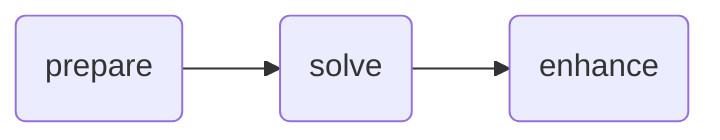

# Chain example

A simple chain pipeline.

## Graph



## Pre-requisites

- Push the echo app as described in the [echo app README](../apps/echo/README.md)

## Usage

```bash
nextmv app push -a <app-id>
echo '{"hello": "world!"}' | nextmv app run -a <app-id>
```
