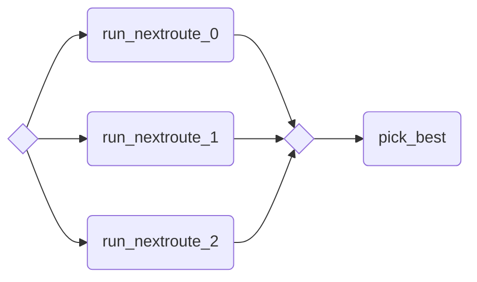

# Ensemble example

A basic ensemble pipeline.

## Graph



## Pre-requisites

- Subscribe to the following marketplace apps and name them as follows:
  - _Nextmv Routing_: `routing-nextroute`

## Usage

```bash
nextmv app push -a <app-id>
cat /path/to/routing/input.json | nextmv app run -a <app-id> -o 'instance=v171-5s'
```
