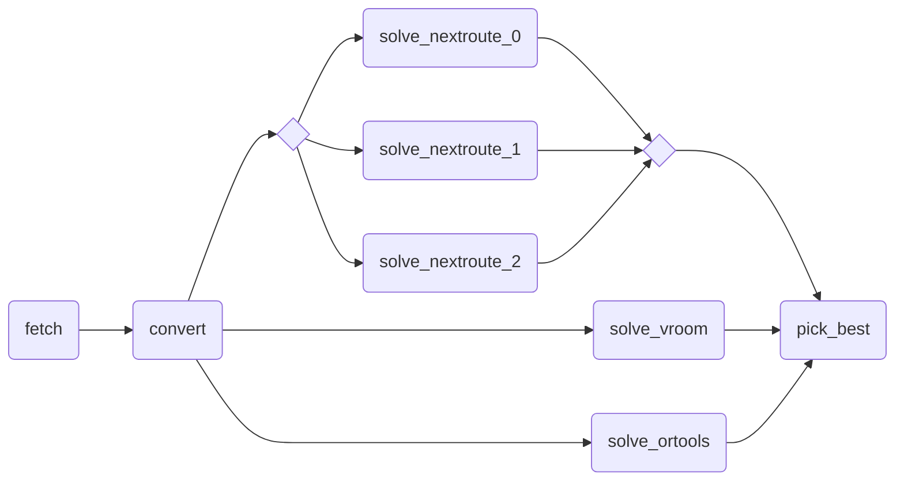

# CSV to JSON multi-solver ensemble example

An example of a pipeline fetching CSV data, converting it to JSON, ensembling across multiple solvers and repetitions and picking the best result.

## Graph



## Pre-requisites

- Subscribe to the following marketplace apps and name them as follows:
  - _Nextmv Routing_: `routing-nextroute`
  - _OR-Tools Routing_: `routing-ortools`
  - _PyVroom Routing_: `routing-pyvroom`

## Usage

```bash
nextmv app push -a <app-id>
echo '{}' | nextmv app run -a <app-id>
```
