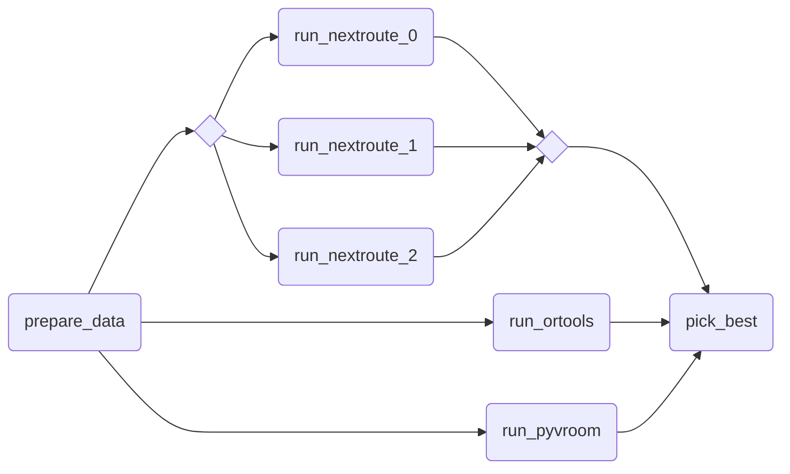

# nextpipe

Framework for Decision Pipeline modeling and execution.

## Installation

```bash
pip install nextpipe
```

## Preview

Example of a pipeline utilizing multiple routing solvers, and picking the best result.



## Modeling

Pipeline modeling is done by defining a flow as steps and decorating them.
The following example demonstrates a 3 step pipeline that makes use of dynamic fanout and joining of results.

```python
from nextpipe import AppOption, AppRunConfig, FlowSpec, app, foreach, join, needs, step


class Flow(FlowSpec):
    @foreach()  # Run the successor step for each item in the result list of this step
    @step
    def prepare(data: dict):
        """
        Creates 3 copies of the input and configures them for 3 different app parameters.
        """
        inputs = [copy.deepcopy(data) for _ in range(3)]
        run_configs = [AppRunConfig(input, [AppOption("param", i)]) for i, input in enumerate(inputs)]
        return run_configs

    @app(app_id="echo")
    @needs(predecessors=[prepare])
    @step
    def solve():
        """
        Imitates a solver app.
        """
        pass

    @needs(predecessors=[solve])
    @join()  # Collect the results from the previous 'foreach' step and combine them into a list passed as the arg
    @step
    def merge(results: list[dict]):
        """Merges the results."""
        return results
```

The pipeline can simply be executed from the main func of the app.

```python
# Run workflow
flow = Flow("DecisionFlow", input.data)
flow.run()

# Write out the result
print(json.dumps(flow.get_result(flow.merge)))
```

## Examples

You can find further examples of how to use `nextpipe` in the [examples](./examples) directory.
