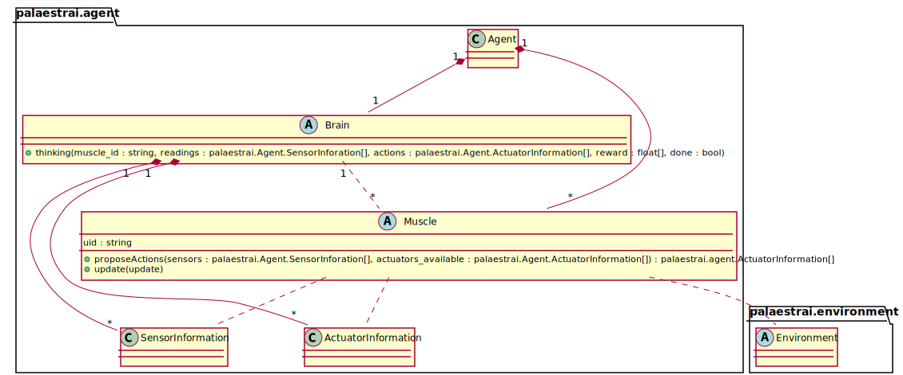

Brain/Muscle API
================

Purpose of Brain and Muscles
----------------------------

In palaestrAI, agents are logically devided into two parts:

1. An executing part, mapping sensor inputs to actions
2. A learning algorithm

Different algorithms have different names for this concept; for example, A3C
calls the muscles *workers*. The split allows agents to learn from different
environment instances (or configurations) simultaneously, in an asynchronous
fashion, or even to have more sophisticated setups. palaestrAI calls the
learner the *brain* (:class:`palaestrai.agent.Brain`). An agent has exactly
one brain. The executing part is known as a *muscle*
(:class:`palaestrai.agent.Muscle`). An agent can have many, but at least one,
muscle.

Agents are represented in an environment with the muscle(s). A muscle receives
sensor readings, upon which it provides actions. From every muscle, the brain
receives the muscle's input, its output (actions), and the reward it received
from these actions. The brain can then train on these information provided
by its muscle(s). When it decides that training is complete, it updates one
(or several, or all) muscles.

How to Add Algorithms to palaestrAI
-----------------------------------

In order to add a new algorithm, you can decide to implement the actor
(muscle), the learner (brain), or both. The latter one is probably the most
common one, as Deep Reinforcement Learning algorithms usually consider both,
actor as well as learner.

The new muscle must implement two methods:

1. :func:`palaestrai.agent.Muscle.propose_actions`
2. :func:`palaestrai.agent.Muscle.update`.

The ``propose_actions()`` method serves as an input-to-action mapper. For
example, this is what the policy network in a forward-pass does in a
Deep Reinforcement Learning setting. The second method, ``update()``, gets
called whenever the brain updates a muscle's configuration, e.g., by providing
new weights to the policy network. What the ``update()`` method's parameter
consists of is up to the implementation.

The brain needs only to implement :meth:`palaestrai.agent.Brain.thinking`. It
receives every muscle's sensor inputs, action, and the reward gained from it.
``update()`` is the main entrypoint for every learner logic.

API Documentation
-----------------

Muscle
~~~~~~

.. autoclass:: palaestrai.agent.Muscle
    :members: mode, memory, setup, prepare_model, load, propose_actions,
        update, reset
    :noindex:

Brain
~~~~~

.. autoclass:: palaestrai.agent.Brain
    :members:
    :noindex:
