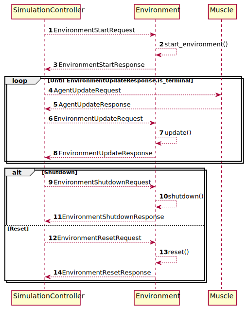

Adding new Environments to palaestrAI
=====================================

Role of an Environment
----------------------

An environment is the world in which an agent lives. More precisely,
subclasses of the :class:`~Environment` receive setpoints from
:class:`~Muscle` objects. Environment classes are self-contained and
encapsule everything that is related to a world, with no knowledge of how
agents interact with it. An environment can be any code, from a simple
class that implements, e.g., Tic-Tac-Toe, to a complex interface to a
simulation tool.

.. note::

    Muscles are the acting part of an agent; the :class:`~Brain` is used for
    training. To learn more about the Brain-Muscle Split, see the
    `quickstart guide <quickstart>`_.

Environments are responsible for maintaining their state, applying setpoints,
and providing sensor data. Environments are responsbile for keeping their
time; there is no time synchronisation between environments. An environment
also signals when it is “done.” What the definition if “done” is, depends on
the environment itself; this is domain-specific. The pole falling in the
famous cartpole environment would mean “done” here, whereas the car crashing
or finishing the race would be the definition of “done” in a racing
environment.

The canonical place for many environment reference implementations is the
`palaestrai-environments <https://gitlab.com/arl2/palaestrai-environments>`_
package.

Implementing Environments: Methods to Provide
---------------------------------------------

When creating a new environment, one has to subclass :class:`~Environment`.
This class provides two important methods that must be implemented:

1. :func:`~Environment.start_environment()`: Launches the environment and
   takes care of any setup code
2. :func:`~Environment.update()`: Applies values (via
   :class:`~ActuatorInformation`) to an environment and  returns new sensor
   readings (:class:`~SensorInformation`) and reward values
   (:class:`~RewardInformation`).

Additionally, one can reimplement the existing :meth:`~Environment.reset()`
method if necessary. The default implementation simply calls
:meth:`~Environment.start_environment()` and does a bit of housekeeping.

Starting an Environment
~~~~~~~~~~~~~~~~~~~~~~~

.. automethod:: palaestrai.environment.Environment.start_environment
    :noindex:

Updating an Environment
~~~~~~~~~~~~~~~~~~~~~~~

.. automethod:: palaestrai.environment.Environment.update
    :noindex:

Resetting an Environment (optional to implement)
~~~~~~~~~~~~~~~~~~~~~~~~~~~~~~~~~~~~~~~~~~~~~~~~

.. automethod:: palaestrai.environment.Environment.reset
    :noindex:

Developer Background: Lifecycle of an Environment
-------------------------------------------------

Environments live in their own processes. Environment objects and their
processes are created by the :class:`~SimulationController`. All other API
calls happen indirectly through messages. The life cycle of an environment is:

1. Environment is created by a :class:`~SimulationController` and
   transferred to a separate process.
2. The environment receives a :class:`~EnvironmentStartRequest`. Via its
   answer (:class:`~EnvrionmentStartResponse`), it delivers available
   sensors, actuators, and initial sensor readings
   (the :class:`~EnvironmentBaseline` return value of
   :meth:`~Environment.start_environment()`).
3. Repeatedly, until the environment is done or another termination condition
   is fulfilled, the :class:`~SimulationController` queries one (or all)
   agents for new setpoints, which are then provided to the environment. The
   environment updates its state and returns new sensor readings as well as
   reward information
4. A shutdown or reset ends the loop of (3).

