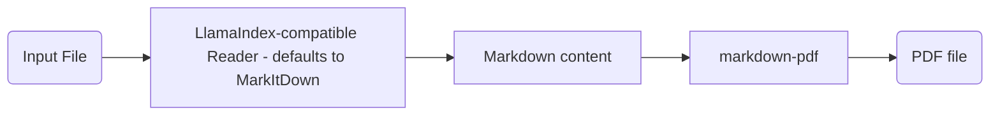

<div align="center">
<h1>PdfItDown</h1>
<h2>Convert Everything to PDF</h2>
</div>
<br>
<div align="center">
    <a href="https://discord.gg/AXcVf269"></a>
</div>
<br>
<div align="center">
    
</div>

**PdfItDown** is a python package that relies on [`markitdown` by Microsoft](https://github.com/microsoft/markitdown/), [`markdown_pdf`](https://github.com/vb64/markdown-pdf), [img2pdf](https://pypi.org/project/img2pdf/) and [`LlamaIndex`](https://www.llamaindex.ai/). Visit us on our [documentation website](https://pdfitdown.eu)!

### Applicability

**PdfItDown** is applicable to the following file formats:

- Markdown
- PowerPoint
- Word
- Excel
- HTML
- Text-based formats (CSV, XML, JSON)
- ZIP files (iterates over contents)
- Image files (PNG, JPG)

The format-specific support needs to be evaluated for the specific reader you are using.

### How does it work?

**PdfItDown** works in a very simple way:

- From **markdown** to PDF


- From **image** to PDF


- From other **text-based** file formats to PDF



### Installation and Usage

To install **PdfItDown**, just run:

```bash
python3 -m pip install pdfitdown
```

You can now use the **command line tool**:

```
usage: pdfitdown [-h] [-i INPUTFILE] [-o OUTPUTFILE] [-t TITLE] [-d DIRECTORY]

options:
  -h, --help            show this help message and exit
  -i, --inputfile INPUTFILE
                        Path to the input file(s) that need to be converted to PDF. The path should be comma
                        separated: input1.csv,input2.md,...,inputN.xml.
  -o, --outputfile OUTPUTFILE
                        Path to the output PDF file(s). If more than one input file is provided, you should provide an
                        equally long list of output files. The path should be comma separated:
                        output1.pdf,output2.pdf,...,outputN.pdf. Defaults to 'None'
  -t, --title TITLE     Title to include in the PDF metadata. Default: 'File Converted with PdfItDown'. If more than
                        one file is provided, it will be ignored.
  -d, --directory DIRECTORY
                        Directory whose files you want to bulk-convert to PDF. If the --inputfile argument is also
                        provided, it will be ignored. Defaults to None.
```

An example usage can be:

```bash
pdfitdown -i README.md -o README.pdf -t "README"
```

Or you can use it **inside your python scripts**:

```python
from pdfitdown.pdfconversion import Converter

converter = Converter()
converter.convert(file_path = "business_grow.md", output_path = "business_growth.pdf", title="Business Growth for Q3 in 2024")
converter.convert(file_path = "logo.png", output_path = "logo.pdf")
converter.convert(file_path = "users.xlsx", output_path = "users.pdf")
```

You can also convert **multiple files at once**:

- In the CLI:

```bash
# with custom output paths
pdfitdown -i "test0.png,test1.csv" -o "testoutput0.pdf,testoutput1.pdf"
# with inferred output paths
pdfitdown -i "test0.png,test1.csv"
```

- In the Python API:

```python
from pdfitdown.pdfconversion import Converter
from llama_parse import LlamaParse
from dotenv import load_dotenv
import os

load_dotenv()

reader = LlamaParse(api_key=os.getenv("llamacloud_api_key"), result_type="markdown")
converter = Converter(reader=reader)
# with custom output paths
converter.multiple_convert(file_paths = ["business_growth.md", "logo.png"], output_paths = ["business_growth.pdf", "logo.pdf"])
# with inferred output paths
converter.multiple_convert(file_paths = ["business_growth.md", "logo.png"])
```

You can bulk-convert **all the files in a directory**:

- In the CLI:

```bash
pdfitdown -d tests/data/testdir
```

- In the Python API:

```python
from pdfitdown.pdfconversion import Converter

converter = Converter()
output_paths = converter.convert_directory(directory_path = "tests/data/testdir")
print(output_paths)
```

Or you can just launch a [Gradio](https://gradio.app)-based user interface:

```bash
pdfitdown_ui
```

You will be able to see the application running on `http://localhost:7860` within seconds!

Watch the demo here:

[](https://raw.githubusercontent.com/AstraBert/PdfItDown/main/img/pdfitdown_ui_demo.mp4)

### Contributing

Contributions are always welcome!

Find contribution guidelines at [CONTRIBUTING.md](https://github.com/AstraBert/PdfItDown/tree/main/CONTRIBUTING.md)

### License and Funding

This project is open-source and is provided under an [MIT License](https://github.com/AstraBert/PdfItDown/tree/main/LICENSE).

If you found it useful, please consider [funding it](https://github.com/sponsors/AstraBert).
