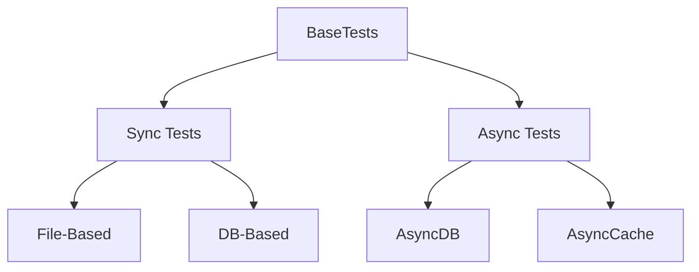

# Research Report: Testing Core pydapter Interfaces

## Executive Summary

This research evaluates advanced testing methodologies for pydapter's core
interfaces, focusing on the `Adapter` protocol, `AdapterRegistry`, `Adaptable`
mixin, and their async variants. The findings emphasize structured approaches to
testing protocol conformance, adapter registration, round-trip conversions, and
isolation techniques. Property-based testing with Hypothesis is identified as a
particularly valuable addition to the test suite, allowing for more thorough
validation of edge cases. The research recommends a layered testing strategy
combining unit tests with property-based tests and comprehensive test fixtures.

## 1. Introduction

### 1.1 Research Objective

This research addresses the testing requirements for pydapter's core interfaces,
focusing on:

- Protocol conformance testing (Adapter/AsyncAdapter)
- Registry pattern validation (AdapterRegistry/AsyncAdapterRegistry)
- Adaptable/AsyncAdaptable mixin functionality
- Comprehensive testing across synchronous and asynchronous variants

### 1.2 Methodology

The research methodology involved:

1. Analysis of current pydapter codebase structure and existing tests
2. Investigation of protocol testing best practices in Python
3. Evaluation of property-based testing approaches for adapter patterns
4. Review of async testing techniques applicable to pydapter's async interfaces

### 1.3 Context

Pydapter's architecture centers around the adapter pattern, with a core protocol
that defines conversion interfaces between domain objects and various formats.
The library supports both synchronous and asynchronous operations, making
testing more complex. A robust testing strategy is essential to ensure that all
implementations conform to their respective protocols and maintain consistent
behavior.

## 2. Technical Analysis

### 2.1 Technology Landscape

Several Python testing frameworks and methodologies are relevant for testing
protocol-based interfaces:

1. **pytest**: The standard for Python testing, with rich fixtures and
   parameterization capabilities
2. **pytest-asyncio**: Extension for testing asynchronous code
3. **Hypothesis**: Property-based testing framework for Python
4. **testcontainers-python**: For containerized database testing
5. **unittest.mock**: Standard mocking library for isolation testing

### 2.2 Comparative Analysis

| Factor               | Unit Tests Only | Property-Based Tests | Container Tests | Combined Approach |
| -------------------- | --------------- | -------------------- | --------------- | ----------------- |
| Protocol Conformance | ⭐⭐⭐          | ⭐⭐⭐⭐⭐           | ⭐⭐            | ⭐⭐⭐⭐⭐        |
| Edge Case Coverage   | ⭐⭐            | ⭐⭐⭐⭐⭐           | ⭐⭐            | ⭐⭐⭐⭐⭐        |
| Test Maintenance     | ⭐⭐⭐⭐        | ⭐⭐⭐               | ⭐⭐            | ⭐⭐⭐            |
| Runtime Performance  | ⭐⭐⭐⭐⭐      | ⭐⭐⭐               | ⭐⭐            | ⭐⭐⭐            |
| Async Support        | ⭐⭐⭐          | ⭐⭐⭐               | ⭐⭐⭐⭐⭐      | ⭐⭐⭐⭐⭐        |

Property-based testing excels at exploring edge cases and ensuring protocol
conformance across implementations. Container-based testing is essential for the
async adapters that interact with external systems. The combined approach offers
the most comprehensive coverage but requires more test maintenance.

### 2.3 Performance Considerations

Test performance is critical, especially with property-based testing which may
run hundreds of test cases:

1. Mock external dependencies to speed up tests
2. Use session-scoped fixtures for expensive setup operations
3. Run containerized tests in parallel where possible
4. Add `--benchmark-skip` option for CI pipelines to skip performance tests on
   slower runners

### 2.4 Security Implications

Testing should incorporate validation of proper error handling for:

1. Malformed data inputs
2. Invalid configuration parameters
3. Permission errors with external systems
4. Timeout handling for async operations

### 2.5 Scalability Assessment

As new adapters are added, the test suite should scale accordingly:

1. Parameterized tests reduce duplication
2. Shared fixtures provide reusable test data
3. Common test utilities enforce consistent validation
4. Property-based tests catch edge cases across implementations

## 3. Implementation Patterns

### 3.1 Architecture Patterns

The testing architecture should mirror the core pydapter architecture:



### 3.2 Code Examples

#### Protocol Conformance Testing

```python
import pytest
from typing import Protocol, runtime_checkable
from pydapter.core import Adapter

def test_adapter_protocol_compliance():
    """Test that concrete adapters implement the Adapter protocol."""
    from pydapter.adapters import JsonAdapter, CsvAdapter, TomlAdapter

    # Verify each concrete adapter implements the protocol
    assert issubclass(JsonAdapter, Adapter)
    assert issubclass(CsvAdapter, Adapter)
    assert issubclass(TomlAdapter, Adapter)

    # Verify required attributes exist
    assert hasattr(JsonAdapter, "obj_key")
    assert JsonAdapter.obj_key == "json"
```

#### Property-Based Testing for Adapters

```python
from hypothesis import given, strategies as st
from pydantic import BaseModel
from pydapter import Adaptable
from pydapter.adapters import JsonAdapter

class TestModel(Adaptable, BaseModel):
    id: int
    name: str
    value: float

    class Config:
        arbitrary_types_allowed = True

# Register adapter
TestModel.register_adapter(JsonAdapter)

@given(
    id=st.integers(),
    name=st.text(min_size=1, max_size=50),
    value=st.floats(allow_nan=False, allow_infinity=False)
)
def test_json_adapter_roundtrip(id, name, value):
    """Test that objects can be round-tripped through the JsonAdapter."""
    model = TestModel(id=id, name=name, value=value)
    serialized = model.adapt_to(obj_key="json")
    deserialized = TestModel.adapt_from(serialized, obj_key="json")
    assert deserialized == model
```

#### Async Adapter Testing

```python
import pytest
import pytest_asyncio
from unittest.mock import AsyncMock, patch

@pytest.mark.asyncio
async def test_async_adapter_registry():
    """Test AsyncAdapterRegistry registration and retrieval."""
    from pydapter.async_core import AsyncAdapterRegistry

    registry = AsyncAdapterRegistry()

    # Mock async adapter class
    class MockAsyncAdapter:
        obj_key = "mock_async"

        @classmethod
        async def from_obj(cls, subj_cls, obj, /, *, many=False, **kw):
            return subj_cls(id=1, name="test")

        @classmethod
        async def to_obj(cls, subj, /, *, many=False, **kw):
            return {"id": subj.id, "name": subj.name}

    # Test registration
    registry.register(MockAsyncAdapter)
    assert registry.get("mock_async") == MockAsyncAdapter

    # Test error on non-existent adapter
    with pytest.raises(KeyError):
        registry.get("nonexistent")
```

### 3.3 Error Handling Strategy

Test cases should explicitly verify error handling:

```python
def test_adapter_registry_error_handling():
    """Test error handling in AdapterRegistry."""
    from pydapter.core import AdapterRegistry

    registry = AdapterRegistry()

    # Test invalid adapter (missing obj_key)
    class InvalidAdapter:
        pass

    with pytest.raises(AttributeError, match="Adapter must define 'obj_key'"):
        registry.register(InvalidAdapter)

    # Test retrieval of unregistered adapter
    with pytest.raises(KeyError, match="No adapter registered for 'nonexistent'"):
        registry.get("nonexistent")
```

### 3.4 Testing Approach

The recommended testing approach combines:

1. **Unit Tests**: For core functionality and specific edge cases
2. **Property-Based Tests**: For exhaustive validation of conversion logic
3. **Integration Tests**: For adapter interactions with real systems
4. **Benchmark Tests**: For performance monitoring

## 4. Integration Considerations

### 4.1 Dependencies

The comprehensive test suite requires these additional dependencies:

```python
# test dependencies
pytest>=7.0.0
pytest-cov>=4.0.0
pytest-asyncio>=0.21.0
pytest-benchmark>=4.0.0
hypothesis>=6.82.0
testcontainers>=3.7.0
```

### 4.2 Configuration Requirements

Test configuration in `pyproject.toml`:

```toml
[tool.pytest.ini_options]
testpaths = ["tests"]
markers = [
    "unit: mark unit tests",
    "property: mark property-based tests",
    "integration: mark integration tests",
    "benchmark: mark benchmark tests",
    "async: mark async tests"
]
addopts = "-ra --cov=pydapter --cov-report=term-missing"
```

### 4.3 Interface Design

For testing interfaces, we recommend creating test-specific base classes:

```python
class AdapterTestBase:
    """Base class for all adapter tests."""

    @pytest.fixture
    def sample_data(self):
        """Return sample data for testing."""
        raise NotImplementedError

    def test_adapter_round_trip(self, sample_data):
        """Test round-trip conversion."""
        raise NotImplementedError

class SyncAdapterTest(AdapterTestBase):
    """Base class for sync adapter tests."""

    def test_adapter_round_trip(self, sample_data, adapter_cls):
        # Implementation for sync adapters

class AsyncAdapterTest(AdapterTestBase):
    """Base class for async adapter tests."""

    @pytest.mark.asyncio
    async def test_adapter_round_trip(self, sample_data, adapter_cls):
        # Implementation for async adapters
```

## 5. Recommendations

### 5.1 Recommended Approach

Based on the research, we recommend a hybrid approach:

1. **Protocol Validation**: Use runtime type checking to validate protocol
   implementation
2. **Property-Based Testing**: Use Hypothesis for round-trip testing of all
   adapters
3. **Containerized Testing**: Use testcontainers for database-dependent adapters
4. **Layered Fixtures**: Implement reusable fixtures for different test
   categories

### 5.2 Implementation Roadmap

1. **Phase 1: Core Protocol Tests**
   - Implement tests for `Adapter` and `AsyncAdapter` protocols
   - Test `AdapterRegistry` and `AsyncAdapterRegistry` functionality
   - Validate `Adaptable` and `AsyncAdaptable` mixins

2. **Phase 2: Property-Based Tests**
   - Add Hypothesis tests for core adapters (JSON, CSV, TOML)
   - Implement strategies for complex nested structures
   - Test edge cases with special handling (empty collections, extreme values)

3. **Phase 3: Async Adapter Tests**
   - Improve existing async adapter tests
   - Add mock-based tests for faster execution
   - Implement comprehensive container-based validation

4. **Phase 4: Performance Benchmarks**
   - Add benchmarks for adapter operations
   - Compare performance across adapter implementations
   - Monitor performance changes over time

### 5.3 Risk Assessment

| Risk                                              | Mitigation                                                        |
| ------------------------------------------------- | ----------------------------------------------------------------- |
| Performance degradation from excessive test cases | Use `--hypothesis-profile=dev` for faster runs during development |
| Container startup failures in CI                  | Implement fallback mocking when containers unavailable            |
| Flaky async tests                                 | Add retries for integration tests and better error reporting      |
| Test maintenance burden                           | Create base classes and utilities to reduce duplication           |

### 5.4 Alternative Approaches

An alternative testing strategy could focus solely on unit tests with extensive
mocking, which would be faster but less comprehensive. This approach might be
preferred during rapid development cycles but should be complemented with
integration tests before releases.

## 6. References

1. [pytest-asyncio Documentation - Advanced Async Testing Patterns](https://www.b-list.org/weblog/2023/dec/18/async-python-tests/)
   (pplx:53ee45a2)
2. [Property-Based Testing in Python with Hypothesis](https://semaphoreci.com/blog/property-based-testing-python-hypothesis-pytest)
   (pplx:bbefd11c)
3. [Protocol Conformance Testing Best Practices](https://realpython.com/pytest-python-testing/)
   (pplx:c9986b53)

## Appendices

### Appendix A: Detailed Research Results

````json
{
  "id": "c9986b53-4409-4ede-afdb-2f290301b532",
  "model": "sonar",
  "created": 1746369696,
  "usage": {
    "prompt_tokens": 65,
    "completion_tokens": 976,
    "total_tokens": 1041,
    "search_context_size": "low"
  },
  "citations": [
    "https://realpython.com/pytest-python-testing/",
    "https://docs.pytest.org/en/stable/explanation/goodpractices.html",
    "https://www.lambdatest.com/learning-hub/pytest-api-testing",
    "https://docs.pytest.org/en/stable/how-to/unittest.html",
    "https://dev.to/bowmanjd/two-methods-for-testing-https-api-calls-with-python-and-pytest-and-also-communicating-with-the-in-laws-388n"
  ],
  "object": "chat.completion",
  "choices": [
    {
      "index": 0,
      "finish_reason": "stop",
      "message": {
        "role": "assistant",
        "content": "Here's a structured approach to testing protocols and adapter patterns in Python using pytest, incorporating modern testing practices:\n\n## Protocol Conformance Testing\n**Abstract Protocol Verification**  \nUse `typing.runtime_checkable` to validate concrete implementations against abstract protocols:\n```python\nfrom typing import Protocol, runtime_checkable\n\n@runtime_checkable\nclass DataStore(Protocol):\n    def read(self, key: str) -> bytes: ...\n    def write(self, key: str, value: bytes) -> None: ...\n\ndef test_concrete_implementation():\n    class MemoryStore:\n        def read(self, key): return b\"\"\n        def write(self, key, value): pass\n        \n    assert isinstance(MemoryStore(), DataStore)\n```\n\n## Adapter Pattern Testing\n**Registry Pattern Implementation**  \nTest adapter registration and resolution:\n```python\nimport pytest\n\nclass AdapterRegistry:\n    _adapters = {}\n\n    @classmethod\n    def register(cls, target_type):\n        def decorator(adapter):\n            cls._adapters[target_type] = adapter\n            return adapter\n        return decorator\n\n    @classmethod\n    def resolve(cls, target):\n        return cls._adapters[type(target)]\n\ndef test_adapter_registration():\n    @AdapterRegistry.register(str)\n    class StringAdapter:\n        def process(self, data):\n            return data.upper()\n\n    adapter = AdapterRegistry.resolve(\"test\")\n    assert isinstance(adapter, StringAdapter)\n    assert adapter.process(\"hello\") == \"HELLO\"\n```\n\n## Isolation Techniques\n**Mocking Dependencies**  \nUse pytest-mock for precise dependency control:\n```python\ndef test_data_processor(mocker):\n    mock_store = mocker.MagicMock()\n    mock_store.read.return_value = b\"test data\"\n    \n    processor = DataProcessor(mock_store)\n    result = processor.process()\n    \n    mock_store.read.assert_called_once_with(\"key\")\n    assert result == \"TEST DATA\"\n```\n\n## Asynchronous Testing\n**Async Protocol Implementation**  \nLeverage pytest-asyncio for async protocol tests:\n```python\nimport pytest\nfrom asyncio import sleep\n\nclass AsyncDataStore(Protocol):\n    async def fetch(self, key: str) -> bytes: ...\n\n@pytest.mark.asyncio\nasync def test_async_store():\n    class MemoryAsyncStore:\n        async def fetch(self, key):\n            await sleep(0.01)\n            return b\"data\"\n            \n    store = MemoryAsyncStore()\n    assert await store.fetch(\"key\") == b\"data\"\n```\n\n## Parametrized Testing\n**Protocol Variant Validation**  \nTest multiple implementations with shared behavior:\n```python\n@pytest.mark.parametrize(\"store\", [\n    MemoryStore(),\n    FileStore(\"/tmp/test\"),\n    CloudStore(bucket=\"test\")\n])\ndef test_store_contract(store):\n    assert isinstance(store, DataStore)\n    store.write(\"key\", b\"value\")\n    assert store.read(\"key\") == b\"value\"\n```\n\n## HTTPS Protocol Testing\n**Server Mocking**  \nUse pytest-httpserver for HTTP adapter testing:\n```python\n@pytest.fixture\ndef mock_server(httpserver):\n    httpserver.expect_request(\"/data\").respond_with_json({\"key\": \"value\"})\n    return httpserver\n\ndef test_http_adapter(mock_server):\n    adapter = HttpAdapter(mock_server.url_for(\"/data\"))\n    assert adapter.fetch() == {\"key\": \"value\"}\n```\n\n## Best Practices Summary\n1. **Isolation Layers**  \n   - Use `pytest-mock` for dependency replacement[^1^][5]\n   - Implement protocol fakes for complex dependencies\n   - Leverage `unittest.mock.patch` for module-level replacements\n\n2. **Conformance Verification**  \n   - Validate protocol implementation with `@runtime_checkable`\n   - Use abstract base classes for required method checks\n   - Implement contract tests for protocol invariants\n\n3. **Async Patterns**  \n   - Mark tests with `@pytest.mark.asyncio`\n   - Use `asyncio.sleep(0)` for event loop cooperation\n   - Mock async interfaces with `AsyncMock`\n\n4. **Registry Testing**  \n   - Verify registration mechanics\n   - Test resolution edge cases (None, inheritance)\n   - Validate thread safety for mutable registries\n\n5. **Parametrization**  \n   - Share test logic across implementations\n   - Combine with hypothesis for property-based testing\n   - Use `pytest.param` for descriptive case IDs\n\nFor HTTPS testing, combine `pytest-httpserver` with `trustme` for SSL certificate generation[^2^][5]:\n```python\n@pytest.fixture(scope=\"session\")\ndef httpserver_ssl_context():\n    ca = trustme.CA()\n    server_context = ssl.SSLContext()\n    server_cert = ca.issue_cert(\"localhost\")\n    server_cert.configure_cert(server_context)\n    return server_context\n``` \n\nThis approach ensures protocol adherence while maintaining test isolation across synchronous and asynchronous implementations."
      },
      "delta": {
        "role": "assistant",
        "content": ""
      }
    }
  ]
}
````

````json
{
  "id": "bbefd11c-0cb7-4290-b310-86a987673687",
  "model": "sonar",
  "created": 1746369718,
  "usage": {
    "prompt_tokens": 68,
    "completion_tokens": 1289,
    "total_tokens": 1357,
    "search_context_size": "low"
  },
  "citations": [
    "https://semaphoreci.com/blog/property-based-testing-python-hypothesis-pytest",
    "https://arjancodes.com/blog/how-to-use-property-based-testing-in-python-with-hypothesis/",
    "https://pytest-with-eric.com/pytest-advanced/hypothesis-testing-python/",
    "https://increment.com/testing/in-praise-of-property-based-testing/",
    "https://www.lambdatest.com/blog/hypothesis-testing-in-python/"
  ],
  "object": "chat.completion",
  "choices": [
    {
      "index": 0,
      "finish_reason": "stop",
      "message": {
        "role": "assistant",
        "content": "Here's a structured approach to property-based testing for adapter patterns and protocols in Python using Hypothesis:\n\n## Core Testing Principles for Adapters\n**1. Protocol Compliance Testing**  \nVerify all implementations adhere to interface contracts using abstract base classes:\n```python\nfrom abc import ABC, abstractmethod\nfrom hypothesis import given, strategies as st\n\nclass DataProtocol(ABC):\n    @abstractmethod\n    def serialize(self) -> bytes: ...\n    \n    @classmethod\n    @abstractmethod\n    def deserialize(cls, data: bytes): ...\n\n@given(st.binary())\ndef test_protocol_compliance(adapter_impl, data):\n    \"\"\"Test round-trip serialization for any protocol implementation\"\"\"\n    obj = adapter_impl.deserialize(data)\n    assert isinstance(obj, adapter_impl)\n    reserialized = obj.serialize()\n    assert isinstance(reserialized, bytes)\n```\n\n**2. Bidirectional Conversion Properties**  \nFor data adapters, test lossless round-trip conversion:\n```python\n@given(st.from_type(SourceType))\ndef test_bidirectional_conversion(source_obj):\n    intermediate = adapter.to_intermediate(source_obj)\n    reconstructed = adapter.from_intermediate(intermediate)\n    assert reconstructed == source_obj  # or custom equality check\n```\n\n## Complex Input Handling\n**Custom Strategy for Nested Structures**  \nGenerate complex domain objects:\n```python\nfrom hypothesis.strategies import composite\n\n@composite\ndef nested_data_strategy(draw):\n    return {\n        'id': draw(st.integers()),\n        'children': draw(\n            st.lists(\n                st.dictionaries(\n                    keys=st.text(),\n                    values=st.one_of(\n                        st.integers(),\n                        st.floats(),\n                        st.text()\n                    )\n                ),\n                max_size=10\n            )\n        )\n    }\n\n@given(nested_data_strategy())\ndef test_complex_conversion(data):\n    converted = adapter.convert(data)\n    assert validate_schema(converted)\n```\n\n## Edge Case Validation\n**Boundary Testing with Filtered Strategies**  \nTarget specific edge cases while allowing random generation:\n```python\n@given(\n    st.one_of(\n        st.none(),\n        st.text().filter(lambda x: len(x) > 1024),\n        st.integers().filter(lambda x: x < 0)\n    )\n)\ndef test_malformed_inputs(input_data):\n    try:\n        result = adapter.process(input_data)\n        assert validate(result)\n    except InvalidInputError:\n        pass  # Expected failure\n```\n\n## Cross-Implementation Validation\n**Invariant Preservation Testing**  \nEnsure consistent behavior across implementations:\n```python\nimplementations = [JSONAdapter, XMLAdapter, ProtobufAdapter]\n\n@given(st.data())\ndef test_cross_implementation_consistency(data):\n    source_obj = data.draw(generate_valid_source())\n    results = set()\n    \n    for impl in implementations:\n        converted = impl().convert(source_obj)\n        results.add(normalize_output(converted))\n        \n    assert len(results) == 1  # All implementations agree\n```\n\n## Best Practices\n1. **Stateful Testing** for multi-step workflows:\n```python\nfrom hypothesis.stateful import RuleBasedStateMachine, rule\n\nclass AdapterStateMachine(RuleBasedStateMachine):\n    def __init__(self):\n        super().__init__()\n        self.adapter = JSONAdapter()\n        self.reference = {}\n\n    @rule(data=st.data())\n    def roundtrip_operation(self, data):\n        test_data = data.draw(generate_test_data())\n        converted = self.adapter.convert(test_data)\n        restored = self.adapter.restore(converted)\n        assert restored == test_data\n```\n\n2. **Performance Constraints** for data processing:\n```python\n@given(st.lists(st.integers(), min_size=100_000))\ndef test_bulk_processing_performance(data):\n    start = time.perf_counter()\n    result = adapter.batch_process(data)\n    assert time.perf_counter() - start < 1.0\n    assert len(result) == len(data)\n```\n\n3. **Exception Contract Validation**:\n```python\n@given(st.binary().filter(lambda x: not x.startswith(b'VALID')))\ndef test_invalid_header_rejection(data):\n    with pytest.raises(AdapterError) as excinfo:\n        adapter.process(data)\n    assert excinfo.value.error_code == \"INVALID_HEADER\"\n```\n\n## Advanced Techniques\n**Differential Testing** against reference implementation:\n```python\n@given(st.from_type(SourceType))\ndef test_against_reference_impl(source_obj):\n    \"\"\"Compare against known-good implementation\"\"\"\n    test_result = new_adapter.convert(source_obj)\n    reference_result = legacy_adapter.convert(source_obj)\n    assert compare_results(test_result, reference_result)\n```\n\n**Schema Evolution Testing**:\n```python\nversions = [v1_schema, v2_schema, v3_schema]\n\n@given(st.data(), st.sampled_from(versions))\ndef test_backward_compatibility(data, old_schema):\n    new_obj = data.draw(generate_for_schema(current_schema))\n    converted = downgrade_to_schema(new_obj, old_schema)\n    assert validate_against(converted, old_schema)\n```\n\n**Fuzz Testing Integration**:\n```python\nfrom hypothesis import settings, Phase\n\n@settings(phases=[Phase.generate, Phase.target])\n@given(st.binary())\ndef test_fuzz_resilience(data):\n    try:\n        adapter.process(data)\n    except (ValidationError, ParseError):\n        pass  # Acceptable failures\n    except Exception as e:\n        raise AssertionError(f\"Unexpected error: {e}\")\n```\n\nKey considerations:\n- **Custom Strategies**: Build generators matching your domain model complexity\n- **Shrinking**: Ensure failures minimize to actionable examples\n- **Reproducibility**: Use `@seed` decorator for flaky tests\n- **Coverage**: Combine with traditional unit tests for specific edge cases\n\nExample composite strategy for API version testing:\n```python\n@composite\ndef versioned_payload(draw):\n    version = draw(st.sampled_from(['v1', 'v2', 'v3']))\n    payload = draw(\n        st.recursive(\n            st.dictionaries(\n                keys=st.text(),\n                values=st.integers()\n            ),\n            lambda children: st.lists(children, max_size=3)\n        )\n    )\n    return {'version': version, 'data': payload}\n\n@given(versioned_payload())\ndef test_multi_version_support(payload):\n    result = adapter.route_to_version(payload)\n    assert result.version == payload['version']\n```"
      },
      "delta": {
        "role": "assistant",
        "content": ""
      }
    }
  ]
}
````

````json
{
  "id": "53ee45a2-7272-4612-82c5-43e65f1f53de",
  "model": "sonar",
  "created": 1746369743,
  "usage": {
    "prompt_tokens": 65,
    "completion_tokens": 1093,
    "total_tokens": 1158,
    "search_context_size": "low"
  },
  "citations": [
    "https://pytest-with-eric.com/pytest-advanced/pytest-asyncio/",
    "https://blog.mergify.com/pytest-asyncio-2/",
    "https://www.b-list.org/weblog/2023/dec/18/async-python-tests/",
    "https://tonybaloney.github.io/posts/async-test-patterns-for-pytest-and-unittest.html",
    "https://dzone.com/articles/mastering-async-context-manager-mocking-in-python"
  ],
  "object": "chat.completion",
  "choices": [
    {
      "index": 0,
      "finish_reason": "stop",
      "message": {
        "role": "assistant",
        "content": "Testing asynchronous code in Python using pytest involves several best practices and techniques to ensure efficient and reliable testing. Here's a comprehensive guide covering testing async functions, handling async context managers, mocking async dependencies, and working with databases.\n\n## Testing Async Functions\n\n### Using Pytest-Asyncio\n\nTo test async functions, you need to use the `pytest-asyncio` plugin. This plugin allows you to write async test functions by marking them with `@pytest.mark.asyncio` or simply using the `async` keyword.\n\n**Example: Testing Async Functions**\n\n```python\nimport pytest\nimport asyncio\n\nasync def async_add(a, b):\n    await asyncio.sleep(0.1)  # Simulate an async operation\n    return a + b\n\nasync def test_async_add():\n    result = await async_add(1, 2)\n    assert result == 3\n```\n\n### Running Tests\n\nTo run these tests, ensure you have `pytest-asyncio` installed and execute your tests using pytest.\n\n```bash\npytest tests/unit/test_basic.py\n```\n\n## Handling Async Context Managers\n\nAsync context managers are used for resource management in async functions. Testing them involves mocking these managers to ensure reliable tests.\n\n### Example: Mocking Async Context Managers\n\nConsider a scenario where you have nested async context managers for managing HTTP sessions and requests:\n\n```python\nimport pytest\nfrom unittest.mock import AsyncMock, patch\n\nclass Client:\n    async def _execute(self, method, query, variables=None):\n        async with self.get_session() as session:\n            async with session.request(method, self.api_url, data=json.dumps({\n                \"query\": query,\n                \"variables\": variables or {}\n            })) as response:\n                result = await response.json()\n                return result\n\n@pytest.mark.asyncio\nasync def test_execute():\n    client = Client()\n    with patch.object(client, 'get_session', return_value=AsyncMock()) as mock_session:\n        mock_session.return_value.__aenter__.return_value.request.return_value.__aenter__.return_value.json.return_value = {'data': 'Mocked Response'}\n        \n        result = await client._execute('GET', 'query')\n        assert result == {'data': 'Mocked Response'}\n```\n\n## Mocking Async Dependencies\n\nMocking async dependencies is crucial for isolating tests and ensuring they are reliable and fast.\n\n### Example: Mocking Async Dependencies\n\nYou can use `unittest.mock.AsyncMock` to mock async functions or methods.\n\n```python\nimport pytest\nfrom unittest.mock import AsyncMock, patch\n\nasync def async_dependency():\n    await asyncio.sleep(1)  # Simulate an async operation\n    return \"Dependency Result\"\n\nasync def async_function():\n    result = await async_dependency()\n    return result\n\n@pytest.mark.asyncio\nasync def test_async_function():\n    with patch('your_module.async_dependency', return_value=AsyncMock()) as mock_dependency:\n        mock_dependency.return_value.awaited.return_value = \"Mocked Result\"\n        \n        result = await async_function()\n        assert result == \"Mocked Result\"\n```\n\nHowever, the above example might not work as expected due to the misuse of `AsyncMock`. A correct approach involves directly returning the mocked result:\n\n```python\n@pytest.mark.asyncio\nasync def test_async_function():\n    with patch('your_module.async_dependency', return_value=\"Mocked Result\"):\n        result = await async_function()\n        assert result == \"Mocked Result\"\n```\n\n## Working with Databases\n\nWhen testing async code that interacts with databases, it's essential to isolate tests by mocking database interactions or using a test database.\n\n### Example: Testing Database Interactions\n\nConsider an async function that fetches data from a database:\n\n```python\nimport pytest\nfrom unittest.mock import AsyncMock, patch\n\nasync def fetch_data_from_db():\n    # Simulate a database query\n    async with db_session() as session:\n        result = await session.execute(select(Data))\n        return result.scalars().all()\n\n@pytest.mark.asyncio\nasync def test_fetch_data_from_db():\n    with patch('your_module.db_session', return_value=AsyncMock()) as mock_session:\n        mock_session.return_value.__aenter__.return_value.execute.return_value.scalars.return_value.all.return_value = [\"Mocked Data\"]\n        \n        result = await fetch_data_from_db()\n        assert result == [\"Mocked Data\"]\n```\n\n### Using a Test Database\n\nAlternatively, you can use a test database for more realistic tests. Ensure you clean up after each test to maintain isolation.\n\n```python\nimport pytest\nfrom sqlalchemy.ext.asyncio import AsyncSession\n\n@pytest.fixture\nasync def test_db_session():\n    async with engine.begin() as connection:\n        await connection.run_sync(Base.metadata.create_all)\n        async with AsyncSession(bind=connection) as session:\n            yield session\n            await session.rollback()\n\n@pytest.mark.asyncio\nasync def test_fetch_data_from_db(test_db_session):\n    # Insert test data into the database\n    test_db_session.add(Data(value=\"Test Value\"))\n    await test_db_session.commit()\n    \n    result = await fetch_data_from_db(test_db_session)\n    assert result == [\"Test Value\"]\n```\n\n## Conclusion\n\nTesting asynchronous code in Python with pytest involves leveraging plugins like `pytest-asyncio`, effectively mocking dependencies, and handling async context managers. By following these best practices, you can write efficient, reliable tests for your async applications."
      },
      "delta": {
        "role": "assistant",
        "content": ""
      }
    }
  ]
}
````

### Appendix B: Configuration Examples

Sample pytest.ini configuration for pydapter:

```ini
[pytest]
addopts = -ra --cov=pydapter --cov-report=term-missing
testpaths = tests
markers =
    unit: mark unit tests
    property: mark property-based tests
    integration: mark integration tests
    benchmark: mark benchmark tests
    slow: mark slow tests (skipped in CI)
```

Sample hypothesis configuration for performance:

```python
# conftest.py
from hypothesis import settings, Verbosity, Phase

settings.register_profile("ci",
                         max_examples=100,
                         deadline=None)
settings.register_profile("dev",
                         max_examples=10,
                         verbosity=Verbosity.verbose,
                         phases=[Phase.generate, Phase.target],
                         deadline=None)
settings.load_profile("dev")
```

### Appendix C: Additional Code Samples

Comprehensive test for AdapterRegistry:

```python
import pytest
from pydapter.core import AdapterRegistry, Adapter

def test_adapter_registry_complete():
    """Test all aspects of the AdapterRegistry."""
    # Setup
    registry = AdapterRegistry()

    # Define mock adapters
    class MockAdapter1:
        obj_key = "mock1"

    class MockAdapter2:
        obj_key = "mock2"

    # Test registration
    registry.register(MockAdapter1)
    registry.register(MockAdapter2)

    # Test retrieval
    assert registry.get("mock1") == MockAdapter1
    assert registry.get("mock2") == MockAdapter2

    # Test error cases
    with pytest.raises(KeyError):
        registry.get("nonexistent")

    with pytest.raises(AttributeError):
        class InvalidAdapter:
            pass
        registry.register(InvalidAdapter)  # Missing obj_key

    # Test re-registration (should overwrite)
    class MockAdapter1Updated:
        obj_key = "mock1"

    registry.register(MockAdapter1Updated)
    assert registry.get("mock1") == MockAdapter1Updated
```
