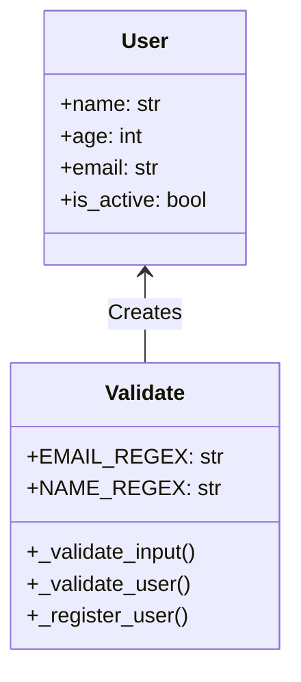

# User Registration Validation System


A robust Python implementation for validating and registering user data with strict type checking and custom validation rules.

## Features

- **Data Validation**:
  - Name: Letters and spaces only
  - Age: 0-120 range check
  - Email: Comprehensive regex validation
- **Error Handling**:
  - Custom exceptions for each validation failure
  - Clear error messages
- **Modern Python**:
  - Type hints throughout
  - Dataclasses for clean data modeling
  - Regex pattern constants

## Installation

1. Clone the repository:
   ```bash
   git clone https://github.com/yourusername/typing_dataclasses.git
   cd typing_dataclasses
   ```

2. Install dependencies (none beyond Python standard library):
   ```bash
   pip install -r requirements.txt  # (Optional: for future dependencies)
   ```

## Usage

```python
from main import Validate

test_data = {
    "name": "John Doe",
    "age": 30,
    "email": "john@example.com"
}

try:
    Validate(test_data)
except (InvalidNameError, InvalidAgeError, InvalidEmailError) as e:
    print(f"Validation failed: {e}")
```

## Expected Output

### Successful Validation:
```
Registered: User(name='John Doe', age=30, email='john@example.com', is_active=True)
```

### Failed Validations:
```
Error caught: Invalid name: John42
Error caught: Invalid age: 150
Error caught: Invalid email: invalid-email
```

## Class Structure



## Validation Rules

| Field | Rules |
|-------|-------|
| Name | Only letters and spaces (`^[a-zA-Z\s]+$`) |
| Age | Between 0 and 120 (inclusive) |
| Email | Standard email format (RFC 5322) |

## Custom Exceptions

- `InvalidNameError`: Name contains invalid characters
- `InvalidAgeError`: Age outside valid range
- `InvalidEmailError`: Malformed email address

## Contributing

1. Fork the project
2. Create your feature branch (`git checkout -b feature/AmazingFeature`)
3. Commit your changes (`git commit -m 'Add some amazing feature'`)
4. Push to the branch (`git push origin feature/AmazingFeature`)
5. Open a Pull Request

## License

Distributed under the MIT License. See `LICENSE` for more information.

## TODO

- [ ] Add logging configuration
- [ ] Implement unit tests
- [ ] Add database integration
- [ ] Create REST API wrapper

Made with ❤️ by Nemkov