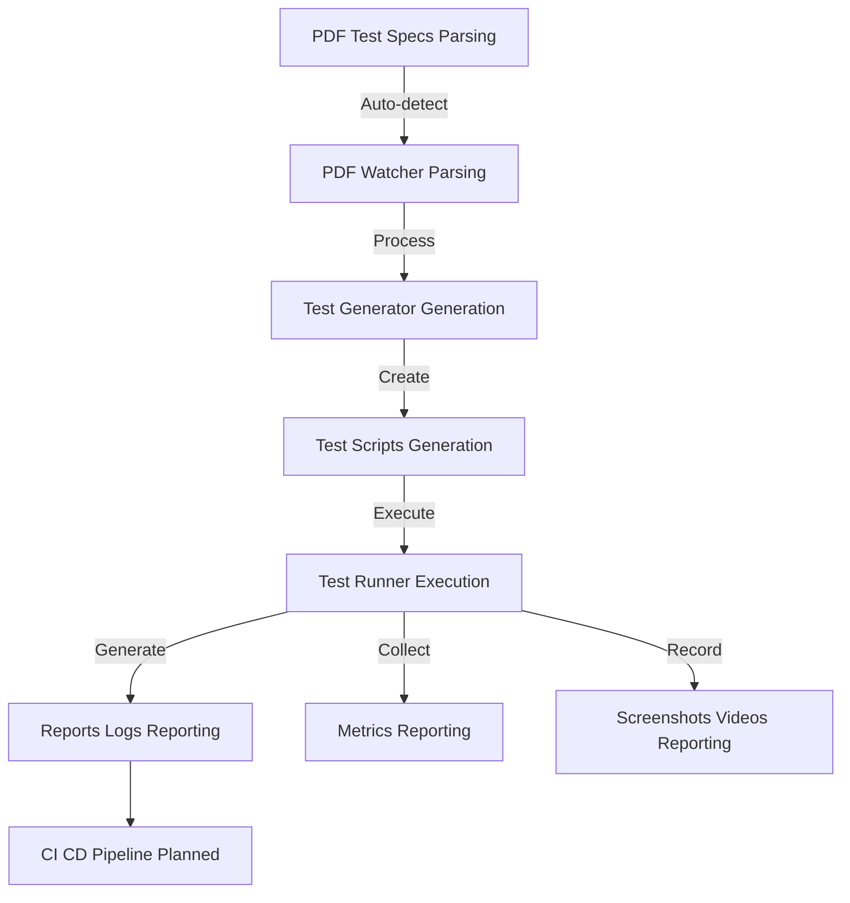

# VAssureAI Framework

VAssureAI is an intelligent test automation framework that transforms PDF-based test specifications into executable, AI-powered browser tests. It supports real-time test generation, versioning, and detailed reporting with screenshots, videos, and metrics.

---

## 1. Setup (Step-by-Step)
1. **Install the package:**
   ```bash
   pip install vassureai
   ```
2. **Initialize the framework:**
   ```bash
   vassure init
   ```
   - This creates all required folders and copies sample files (including README.html).
3. **Install dependencies (if not auto-installed):**
   ```bash
   pip install -r requirements.txt
   ```
4. **Configure environment:**
   - Copy `.env.example` to `.env` and set your API keys and config values.
5. **(Optional) Install PDF watcher as a service:**
   - Windows: `install_pdf_watcher.bat`
   - Linux: `./linux/install_service.sh`

---

## 2. How to Use (Developer Guide)
1. **Add PDF test specs:** Place your PDF files in the `input_pdfs/` folder.
2. **Auto-generate tests:** The watcher or CLI will process PDFs and generate test scripts in `tests/`.
3. **Run tests:**
   - **All tests:**
     ```bash
     python start_framework.py
     ```
   - **Specific test:**
     ```bash
     python start_framework.py --test <test_name>
     ```
   - **Parallel execution:**
     ```bash
     python start_framework.py --parallel --workers 4
     ```
   - **Switch AI provider:**
     ```bash
     python start_framework.py --provider openai
     ```
   - **Run via CLI:**
     ```bash
     python -m vassureai.cli.main run
     ```
   - **Watch PDFs via CLI:**
     ```bash
     python -m vassureai.cli.main watch
     ```
   - **Re-initialize project:**
     ```bash
     python -m vassureai.cli.main init
     ```
4. **View results:** Open HTML reports in the `reports/` folder, review logs and metrics.

---

## 3. High-Level Architecture

**Legend:**
- Parsing: PDF Test Specs, PDF Watcher
- Generation: Test Generator, Test Scripts
- Execution: Test Runner
- Reporting: Reports/Logs, Metrics, Screenshots/Videos
- CI/CD: CI CD Pipeline (Planned)

---

## 4. Workflow: From PDF to Results

```mermaid
graph LR
    A[PDF Ingestion] --> B[PDF Watcher]
    B --> C[PDF Parsing/AI Extraction]
    C --> D[Test Script Generation]
    D --> E[Test Registry Update]
    E --> F[Test Execution Engine]
    F --> G[AI-Driven Browser Automation]
    G --> H[Step-by-Step Execution]
    H --> I[Capture Screenshots/Videos]
    I --> J[Metrics & Logging]
    J --> K[HTML Report Generation]
    K --> L[User Review]
```

**Workflow Stages:**
- **PDF Ingestion:** Place a PDF in `input_pdfs/`.
- **PDF Watcher:** Detects new/changed PDFs (cross-platform).
- **PDF Parsing/AI Extraction:** Extracts test cases using direct parsing or LLMs.
- **Test Script Generation:** Generates/updates Python test scripts in `tests/`.
- **Test Registry Update:** Updates `test_registry.json` for traceability.
- **Test Execution Engine:** Runs tests using Playwright and browser-use.
- **AI-Driven Browser Automation:** AI agent executes test steps in the browser.
- **Step-by-Step Execution:** Each test step is executed, with verification and error handling.
- **Capture Screenshots/Videos:** Screenshots and video are captured at key steps and on errors.
- **Metrics & Logging:** All results, metrics, and logs are collected for reporting and analysis.
- **HTML Report Generation:** Interactive HTML reports are generated in `reports/`.
- **User Review:** Review results, screenshots, videos, and error analysis.

---

## 5. Key Components
- **PDFTestProcessor:** Extracts test cases from PDFs, uses LLMs if direct extraction fails.
- **TestScriptGenerator:** Generates/updates test scripts using Jinja2 templates.
- **BaseTest:** All tests inherit from this; manages execution, error handling, screenshots, and metrics.
- **AI Model Integration:** Supports Gemini, OpenAI, Anthropic via LangChain.
- **Browser Automation:** Uses Playwright and browser-use for intelligent, AI-driven browser control.
- **Metrics & Reporting:** Collects step-by-step results, screenshots, videos, and generates interactive HTML reports.

---

## 6. Troubleshooting & FAQs
- **PDF not detected:** Ensure file is in `input_pdfs/`, check permissions, restart watcher.
- **Test generation fails:** Check PDF format, verify API keys, review `logs/pdf_watcher.log`.
- **Test execution errors:** Ensure browser is installed, check network, review prerequisites.
- **Reports not generated:** Check `reports/` directory, review logs for errors.
- **How do I add a new test?** Place a new PDF in `input_pdfs/`.
- **How do I update a test?** Replace the PDF with a new version; the system auto-updates the script.
- **How do I run tests in parallel?** Use the CLI or batch script and select parallel execution.
- **Where are screenshots/videos?** In `reports/screenshots/` and `videos/`.
- **How do I switch AI providers?** Set the provider in `.env` (e.g., `DEFAULT_PROVIDER=openai`).

---

*For advanced usage and technical details, see `technicalguide.html`.*

<div align="right"><sub><sup>Author: Sukumar Kutagulla (Read-only) &nbsp; Designation: Test Automation Architect (Read-only)</sup></sub></div>