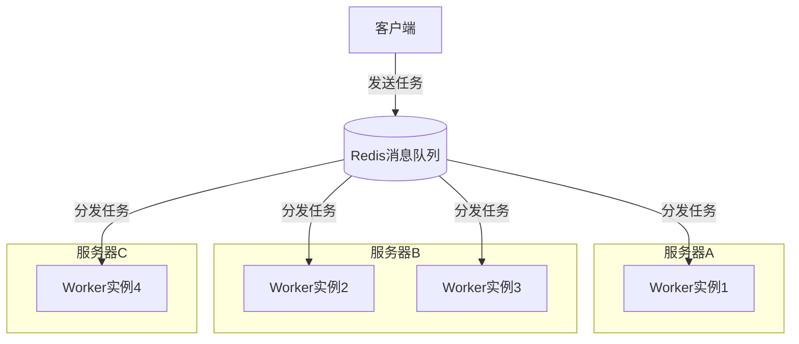

# VoidRail

VoidRail 的名称来自于古老的修仙界，是虚空传送阵的意思。

VoidRail 基于 Celery 构建轻量级分布式任务处理框架，专为 CPU 密集型计算设计。它提供简单易用的接口，让您可以快速构建和部署分布式计算服务。

## 安装

使用 pip 安装：

```bash
pip install voidrail
```

## 核心组件

VoidRail 采用两组件架构：

1. **Worker**：服务实现模块，继承 `CeleryWorker` 基类，定义处理逻辑
2. **Client**：客户端模块，使用 `CeleryClient` 类发送任务请求

## 基本使用

### 创建服务

创建一个 Python 模块，例如 `hello_service.py`：

```python
from voidrail import CeleryWorker, task

class HelloService(CeleryWorker):
    """简单的示例服务"""
    
    def __init__(self):
        # 初始化父类
        super().__init__(service_name="hello")
        
        # 注册任务
        @task(name='hello.say_hello')
        def say_hello(name):
            """简单的问候任务"""
            return f"Hello, {name}!"
        
        @task(name='hello.say_hello_delay', bind=True)
        def say_hello_delay(self, name, delay=3):
            """带进度更新的任务"""
            self.update_state(state='PROGRESS', meta={'progress': 0})
            # 处理逻辑...
            return f"Hello after delay, {name}!"

if __name__ == "__main__":
    service = HelloService()
    service.start_worker()
```

### 使用客户端

```python
from voidrail import CeleryClient

# 创建客户端
client = CeleryClient(service_name="hello")

# 同步调用
result = client.call(
    task_name="say_hello",
    args=["World"],
    wait_result=True
)
print(result["result"])  # 输出: Hello, World!

# 异步调用
async_result = client.call(
    task_name="say_hello_delay",
    args=["Async World"],
    kwargs={"delay": 2},
    wait_result=False
)
task_id = async_result["task_id"]

# 检查任务状态
status = client.get_task_status(task_id)
```

## 高级用例

### 在一个服务类中定义多个任务方法

在同一个 `CeleryWorker` 子类中，您可以定义任意数量的任务方法：

```python
class CalculationService(CeleryWorker):
    def __init__(self):
        super().__init__(service_name="calculator")
        
        @task(name='calculator.add')
        def add(a, b):
            return a + b
            
        @task(name='calculator.multiply')
        def multiply(a, b):
            return a * b
            
        @task(name='calculator.divide')
        def divide(a, b):
            return a / b
```

客户端调用：

```python
calc_client = CeleryClient(service_name="calculator")
result1 = calc_client.call("add", args=[10, 20])
result2 = calc_client.call("multiply", args=[5, 6])
```

### 定义多个服务类

您可以创建多个 `CeleryWorker` 子类，每个类负责一组相关功能：

```python
# 文本处理服务
class TextService(CeleryWorker):
    def __init__(self):
        super().__init__(service_name="text")
        
        @task(name='text.uppercase')
        def to_uppercase(text):
            return text.upper()
            
# 图像处理服务
class ImageService(CeleryWorker):
    def __init__(self):
        super().__init__(service_name="image")
        
        @task(name='image.resize')
        def resize_image(image_data, width, height):
            # 图像处理逻辑
            return processed_image
```

### 多个服务共享同一个 Redis 队列

多个不同的服务可以连接到同一个 Redis 队列，并各自处理自己的任务：

```python
# 服务A
class ServiceA(CeleryWorker):
    def __init__(self):
        # 指定相同的 broker_url
        super().__init__(
            service_name="service_a",
            broker_url="redis://localhost:6379/0"
        )
        
        @task(name='service_a.task1')
        def task1(data):
            return f"ServiceA处理: {data}"

# 服务B
class ServiceB(CeleryWorker):
    def __init__(self):
        # 使用相同的 broker_url
        super().__init__(
            service_name="service_b",
            broker_url="redis://localhost:6379/0"
        )
        
        @task(name='service_b.task1')
        def task1(data):
            return f"ServiceB处理: {data}"
```

Celery 会基于任务名称将请求正确路由到相应的服务实例。客户端通过指定完整任务名称来调用特定服务：

```python
client = CeleryClient(
    service_name="common_client",
    broker_url="redis://localhost:6379/0"
)

# 调用服务A的任务
result_a = client.call("service_a.task1", args=["测试数据"])

# 调用服务B的任务
result_b = client.call("service_b.task1", args=["测试数据"])
```

### 水平扩展能力

VoidRail的一个主要优势是支持简单而强大的水平扩展。当您启动多个相同服务的Worker实例时：

1. **自动负载均衡**：所有实例会自动协作处理队列中的任务
2. **无需额外配置**：不需要任何特殊设置，只需启动更多相同的服务实例
3. **容错和高可用**：如果某个实例崩溃，其他实例会继续处理任务

例如，您可以在多台服务器上启动相同的服务：



## 运行多个Worker实例

要充分利用多核CPU，可以启动多个Worker实例：

```bash
# 启动Worker进程
# 通过环境变量控制并发度
CELERY_CONCURRENCY=4 python hello_service.py
```

您可以在不同的服务器上多次启动相同的服务实例：

```bash
# 在服务器A上
python hello_service.py

# 在服务器B上
python hello_service.py

# 在服务器C上
python hello_service.py
```

每个实例都会自动加入相同的worker池，共同处理任务队列。Celery会为每个worker分配一个唯一ID，
确保任务只会被处理一次。这种设计使VoidRail非常适合需要动态扩展的场景 - 随着负载增加，
只需启动更多的worker实例即可线性提高处理能力。

## 最佳实践

1. **任务颗粒度**：设计适当大小的任务，过小的任务消息开销大，过大的任务不利于分布式处理
2. **错误处理**：在任务中妥善处理异常，避免服务崩溃
3. **状态更新**：对于长时间运行的任务，定期更新进度状态
4. **服务命名**：使用有意义的服务名称和任务名称，便于管理和调试
5. **监控**：定期检查队列状态和服务健康状态
6. **增量扩展**：根据系统负载，逐步添加更多worker实例，而不是一次性部署过多
